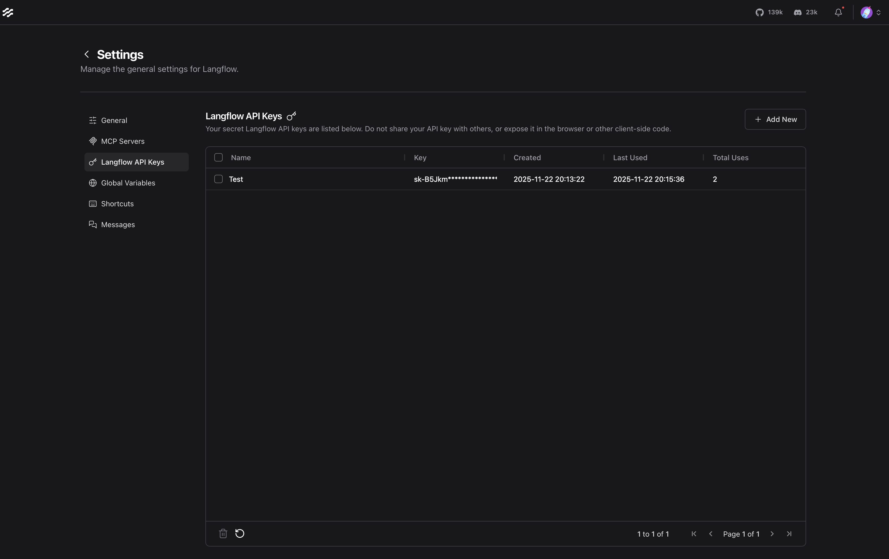
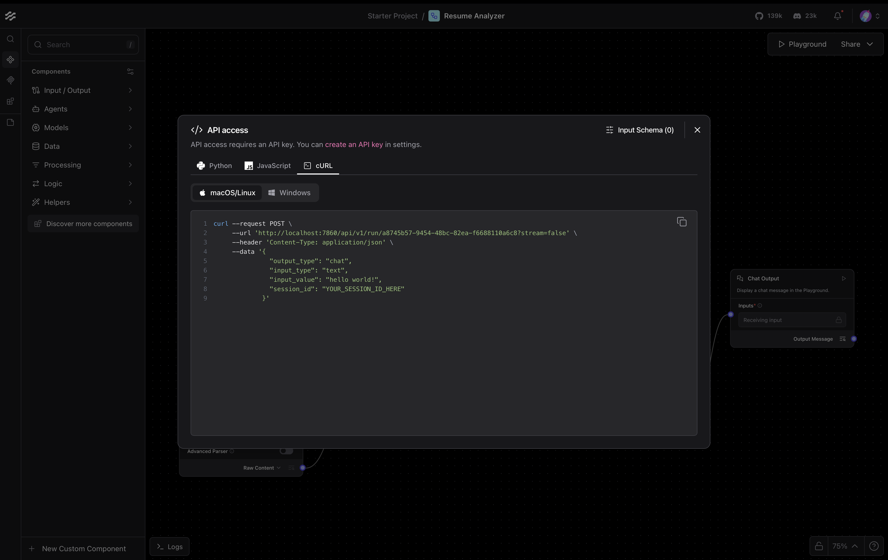

## 快速開始

### 1. 安裝 LangFlow

請訪問 [LangFlow Desktop](https://www.langflow.org/desktop) 並下載 LangFlow 應用程式。按照螢幕上的指示完成安裝與註冊。


*示例：在 LangFlow 中生成 API 金鑰。*

---

### 2. 啟動 LangFlow 應用程式

安裝完成後，打開 LangFlow 應用程式。圖形介面（GUI）將會顯示，讓你管理與執行流程。
啟動應用程式時，會啟動一個 **本地伺服器**，監聽端口 `7860`。


*示例：LangFlow GUI 中的 API 存取設定。*

---

### 3. 載入流程

在 LangFlow GUI 的專案頁面，點擊 **Upload a Flow**。選擇整合資料夾中的任意 `flow.json` 檔案，以匯入並執行流程。

---

### 4. 透過 API 存取流程

你可以透過本地 API 以程式方式與流程互動。每個流程都有一個 **唯一的 Flow ID**（例如 `a8745b57-9454-48bc-82ea-f6688110a6c8`），在建立時隨機生成。請使用該 ID 作為請求 URL：

```bash
curl --request POST \
     --url 'http://localhost:7860/api/v1/run/a8745b57-9454-48bc-82ea-f6688110a6c8?stream=false' \
     --header 'Content-Type: application/json' \
     --header 'x-api-key: YOUR_LANGFLOW_API_KEY' \
     --data '{
         "output_type": "chat",
         "input_type": "chat",
         "input_value": "who are you",
         "session_id": "test"
     }'
```

> **注意：** 請將 `YOUR_LANGFLOW_API_KEY` 替換為你在上一步建立的 API 金鑰。
> 除了 `curl`，你也可以使用 LangFlow GUI 提供的 **Python** 或 **JavaScript** 範例程式碼。請在 GUI 中點擊 **Share → API Access** 取得示例。

