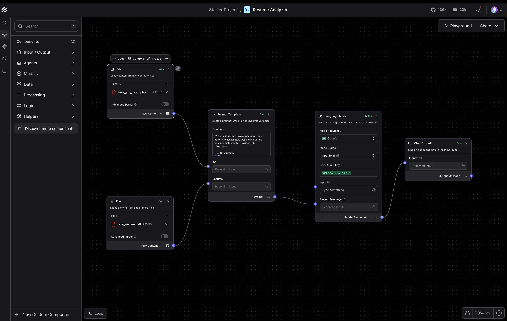

# 簡歷分析流程

**簡歷分析流程** 是一個LangFlow的flow，用於評估候選人的簡歷與職位描述的匹配程度。
它提供 **結構化的評估**，包含數值評分與分析理由，便於整合到 HR 流程、招聘工作流或自動化評估系統中。

> **注意：** 在生產環境中，建議使用網頁爬蟲（例如 LangFlow 支援的 Firecrawl 套件）自動取得職位描述，而不是提供靜態文件。
> 同時，請確保你的 **OpenAI API Key** 已透過流程的語言模型組件設置，或透過 LangFlow UI 使用者設定中的環境配置進行設置。

---

## 🔹 主要功能

* **評估分數**：提供 0–10 的評分，表示簡歷與職位描述的匹配程度。
* **分析理由**：以要點形式說明技能、經驗、教育背景及可能的空缺。
* **靈活適用**：適用於任何職業領域，不僅限於科技或 AI 崗位。
* **開箱即用**：附帶導出的 `flow.json` 文件，可直接導入 LangFlow 使用。
* **可視化預覽**：包含流程截圖，幫助理解其結構與邏輯 。

---

## 📁 儲存庫結構

```
resume-analyzer/
├── README.md
├── flow.json              # LangFlow 導出的流程
└── assets/                # 可選的圖片、PDF 與截圖
    ├── fake-job-description.pdf
    ├── fake-resume.pdf
    └── resume-analyzer-flow.png
```

---

## 🚀 快速開始

1. 打開你的 LangFlow 應用程式
2. 前往 **Import Flow**
3. 選擇此資料夾中的 `flow.json`
4. 輸入你的 **職位描述** 與 **簡歷**
5. 流程將輸出：

```
Evaluation: X/10

Reasoning:
- [理由 1]
- [理由 2]
- [理由 3]
```

---

## ⚡ 使用案例

此流程適用於：

* 快速篩選簡歷與職位描述的匹配度
* 自動化初步候選人評估
* 與 HR 系統整合，提供一致的評估結果
