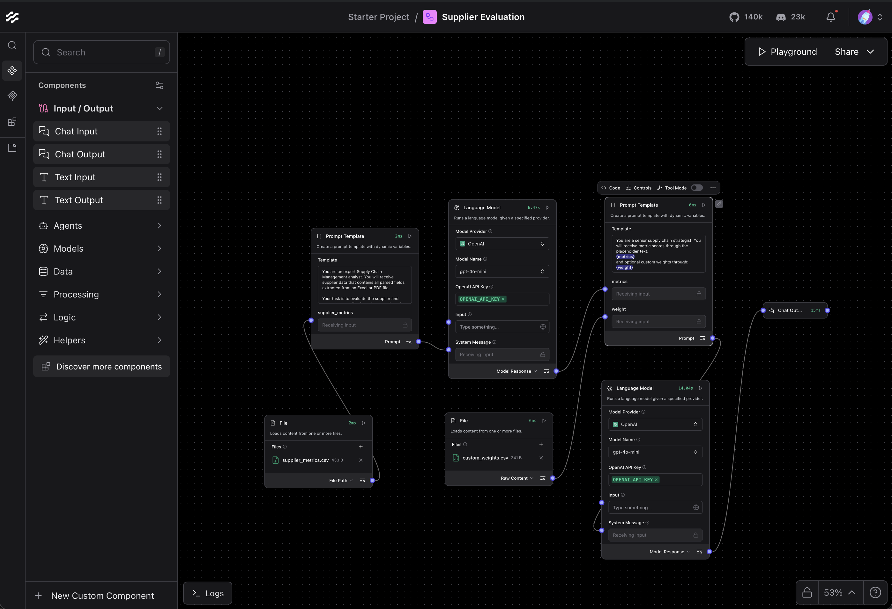

# 供應商評估流程 (Supplier Evaluation Flow)

**供應商評估流程** 是一個 LangFlow 整合方案，用於評估供應商的績效、風險及整體可靠性。
它提供 **結構化的數值評估** 並附有評分理由，協助團隊做出更明智的採購與供應決策。

> **注意：** 若要在實務中使用，請提供更新的供應商資料（CSV 或 JSON 格式）。若使用 Excel 或 PDF，請先轉成 LangFlow 可解析的格式。
> 確保你的 **OpenAI API Key** 已透過 LLM 元件或 LangFlow 環境設定完成配置。

---

## 🔹 主要功能

* **供應商指標計算**：對關鍵績效指標（如準時交貨率、訂單準確率、品質缺陷率、財務穩定性、響應能力）進行標準化評分。
* **綜合指數生成**：計算加權指數，包括供應商績效指數 (SPI)、供應商風險指數 (SRI) 與整體供應商評分 (OSS)。
* **評分理由**：對每個指標及指數提供解釋，說明評分依據。
* **彈性輸入**：支援 CSV、JSON 或經解析的 PDF/Excel 資料。
* **即插即用**：附帶可直接匯入 LangFlow 的 `flow.json`。

**流程視覺化預覽：**


---

## �� 資料夾結構

```
supplier-evaluation/
├── README.md
├── flow.json                 # LangFlow 匯出流程
├── supplier_metrics.csv      # 範例供應商指標資料
├── custom_weights.csv        # 可選自訂權重
└── assets/                   # 可選截圖與範例檔案
    └── supplier-evaluation-flow.png
```

---

## 🚀 使用方式

1. 開啟 LangFlow，並前往 **Import Flow**
2. 選擇本資料夾中的 `flow.json`
3. 上傳供應商資料 (CSV 或 JSON) 並可選擇自訂權重
4. 流程將輸出結果如下：

---

### 範例輸出

以下為依據提供的指標與權重計算出的供應商綜合指數：

```json
{
  "indices": {
    "Supplier Performance Index (SPI)": {
      "value": 80.25,
      "weights": {
        "on_time_delivery": 25,
        "order_accuracy": 20,
        "lead_time_reliability": 20,
        "quality_defect_rate": 20,
        "responsiveness": 15
      },
      "reason": "SPI 反映供應商在準時交貨與訂單準確率的強勁表現，整體分數穩健。"
    },
    "Supplier Risk Index (SRI)": {
      "value": 61.0,
      "weights": {
        "risk_exposure": 50,
        "financial_stability": 30,
        "sustainability_score": 20
      },
      "reason": "SRI 顯示中等風險與財務穩定性，在永續性方面仍有提升空間。"
    },
    "Overall Supplier Score (OSS)": {
      "value": 73.15,
      "weights": {
        "SPI_contribution": 60,
        "risk_adjustment": 40
      },
      "formula": "OSS = (SPI * 0.6) + ((100 - SRI) * 0.4)",
      "reason": "OSS 綜合 SPI 並調整風險，提供供應商績效與風險的平衡評分。"
    }
  }
}
```

---

### 權重說明

**供應商績效指數 (SPI) 權重：**

* 準時交貨率：25%
* 訂單準確率：20%
* 交期可靠性：20%
* 品質缺陷率：20%
* 響應能力：15%

**供應商風險指數 (SRI) 權重：**

* 風險曝露：50%
* 財務穩定性：30%
* 永續性評分：20%

**整體供應商評分 (OSS) 權重：**

* SPI 貢獻：60% (SPI 的加權貢獻)
* 風險調整：40% (依風險曝露進行調整)

---

### 計算細節

* **SPI 計算：**
  `SPI = (85 × 0.25) + (90 × 0.20) + (75 × 0.20) + (80 × 0.20) + (65 × 0.15) = 80.25`

* **SRI 計算：**
  `SRI = (50 × 0.50) + (70 × 0.30) + (60 × 0.20) = 61.0`

* **OSS 計算：**
  `OSS = (80.25 × 0.6) + ((100 - 61.0) × 0.4) = 73.15`

這些指數提供供應商績效與風險的完整概覽，協助戰略決策。

---

## ⚡ 使用情境

此流程適用於：

* 一致性評估供應商可靠性與績效
* 以數據為基礎支持採購決策
* 將供應商評分整合至供應鏈儀表板或 ERP 系統
